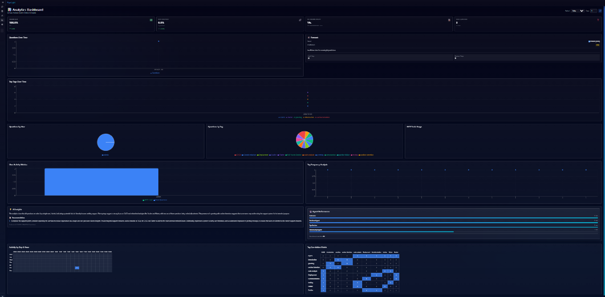
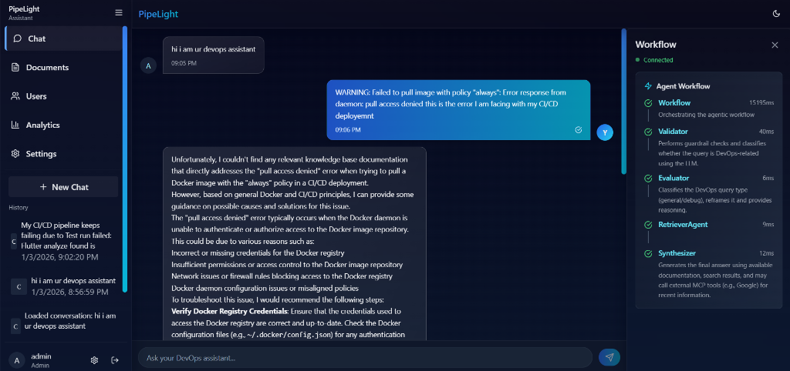

# Pipe Light - Multi-Agent DevOps Helper

Pipe Light is a powerful, agentic AI assistant designed specifically for DevOps workflows. It leverages a multi-agent architecture powered by **LangGraph** to understand, validate, research, and answer complex DevOps questions. It combines **Retrieval-Augmented Generation (RAG)** with real-time web search capabilities via the **Model Context Protocol (MCP)** to provide accurate and up-to-date information.

## 🚀 Key Features

*   **Multi-Agent Architecture**: A sophisticated web of specialized agents working together to solve problems.
*   **Intelligent Routing**: Automatically distinguishes between DevOps and non-DevOps queries, routing them to the appropriate handlers.
*   **Guardrails & Validation**: Ensures queries are safe and relevant before processing.
*   **RAG (Retrieval-Augmented Generation)**: Ingests and retrieves context from your local documentation to answer specific questions.
*   **MCP (Model Context Protocol) Integration**: Extensible tool use, currently featuring **Google Search** (via SerpAPI) to fetch live data from the web.
*   **Pluggable LLM Backend**: Supports **Groq** (Llama 3.3 70B) for high-speed inference, with fallback support for Google Gemini.
*   **Real-time Streaming**: WebSocket-based chat interface that streams agent events and thoughts in real-time.




## 🤖 The Agents

Pipe Light uses a team of specialized agents orchestrated by a LangGraph workflow:

1.  **Validator Agent**: The first line of defense. It checks queries against guardrails and classifies them as "DevOps" or "Non-DevOps".
2.  **Non-DevOps Agent**: Handles general conversation and chitchat, politely redirecting off-topic queries.
3.  **Evaluator Agent**: Deeply analyzes DevOps queries to determine intent (e.g., "General Question" vs. "Debugging/Troubleshooting") and reframes them for better search results.
4.  **Retriever Agent**: A RAG specialist that searches your indexed documentation (PDFs, text files) to find relevant internal knowledge.
5.  **Search Agent (MCP)**: Uses the Google MCP tool to perform live web searches when internal documentation is insufficient or when recent information is needed.
6.  **Synthesizer Agent**: The final answering engine. It combines context from the Retriever, results from the Search Agent, and its own knowledge to generate a comprehensive, cited response.




## 🔌 Universal LLM Support (Plug-and-Play)

Pipelight is designed to be completely **Model Agnostic**. We believe you shouldn't be locked into a single provider. 

**"Change one file, switch any model."**

*   **Centralized Config**: All LLM logic resides solely in `app/llm/llm.py`.
*   **Zero-Friction Swapping**: Want to use **OpenAI GPT-4o**? **Anthropic Claude 3.5**? Or a local **Ollama** model?
    *   Simply update the import in `llm.py` (e.g., `from langchain_openai import ChatOpenAI`).
    *   The entire multi-agent validation, reasoning, and synthesis flow will automatically adapt to the new brain.


## 🔒 Security & Authentication

Pipe Light is built with a **production-first** security mindset, ensuring that your data and agents are protected.

### 🛡️ Core Security Features

*   **JWT (JSON Web Token) Authentication**: State-of-the-art stateless authentication.
    *   All API endpoints (except public auth routes) are protected by a rigid `AuthMiddleware`.
    *   Tokens are signed with a strong `HS256` algorithm and have configurable expiration times.
*   **Password Encryption**: 
    *   User passwords are **never** stored in plain text.
    *   We use **Bcrypt** hashing strategies (via `passlib`) to salt and hash passwords before storage, making them resistant to rainbow table attacks.
*   **Role-Based Access Control (RBAC)**:
    *   Fine-grained permission system embedded in the JWT payload.
    *   Supports distinct roles like `admin` and `user` to restrict sensitive operations.
*   **Secured WebSocket Channels**:
    *   Real-time chat endpoints require valid JWT authentication during the handshake protocols.
*   **Environment-Based Configuration**:
    *   Sensitive keys (API keys, JWT Secrets) are strictly loaded from `.env` files and never hardcoded, following 12-Factor App methodology.

## 🛠️ Tech Stack

*   **Framework**: FastAPI (Python)
*   **Orchestration**: LangGraph, LangChain
*   **LLM**: Groq (Llama-3.3-70b), Google Gemini (Gemini-2.5-flash)
*   **Vector Database**: ChromaDB (for RAG)
*   **Search**: SerpAPI (Google Search)
*   **Server**: Uvicorn

## 📋 Prerequisites

*   Python 3.10+
*   API Keys for:
    *   **Groq**: For the primary LLM.
    *   **SerpAPI**: For Google Search capabilities.
    *   **Google Gemini** (Optional): As a backup LLM.

## ⚙️ Setup & Installation

1.  **Clone the repository:**
    ```bash
    git clone <repository-url>
    cd Backend
    ```

2.  **Create a virtual environment:**
    ```bash
    python -m venv venv
    source venv/bin/activate  # On Windows: venv\Scripts\activate
    ```

3.  **Install dependencies:**
    ```bash
    pip install -r requirements.txt
    ```

4.  **Configure Environment Variables:**
    Create a `.env` file in the `Backend` directory and add your keys:
    ```env
    GROQ_API_KEY=your_groq_api_key
    SERPAPI_API_KEY=your_serpapi_key
    # GOOGLE_API_KEY=your_google_key (Optional)
    
    # Server Config
    HOST=0.0.0.0
    PORT=8000
    PROJECT_NAME="Pipe Light"
    VERSION="1.0.0"
    ```


## 💻 Frontend Application

This repository works in tandem with our modern **Frontend** (located in the `Frontend/` directory). 

*   **Vite + React**: Blazing fast performance and instant HMR.
*   **Premium UI**: Glassmorphism aesthetic with TailwindCSS.
*   **Real-Time Streaming**: seamless WebSocket integration to display agent thoughts, decision steps, and final answers as they happen.

## 🏃‍♂️ Running the Application

Start the backend server using the main entry point:

```bash
python main.py
```

The server will start at `http://localhost:8000`.

*   **API Documentation**: Visit `http://localhost:8000/docs` to explore the REST API.
*   **WebSocket Chat**: The chat interface is available via WebSocket at `ws://localhost:8000/chat`.

## 🧠 Model Context Protocol (MCP)

This application implements the Model Context Protocol to standardize how the LLM interacts with external tools.
Currently, the **Google MCP** is implemented, allowing the agents to autonomously decide when to search the web for real-time answers (e.g., "latest kubernetes version", "aws outage today").

## 📁 Project Structure

*   `app/agents/`: Definitions for all LangGraph agents (Validator, Evaluator, etc.).
*   `app/mcp/`: MCP tool implementations (e.g., Google Search).
*   `app/llm/`: LLM configuration and initialization (Groq/Gemini).
*   `app/api/`: FastAPI routes for Chat, Users, and Documentation.
*   `app/core/`: Core settings, config, and logging.
